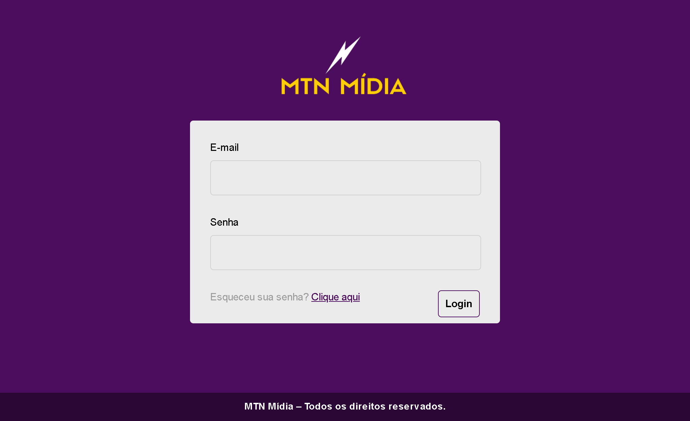
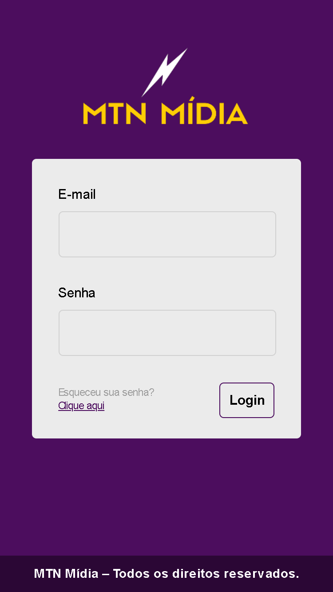

<h1>
    Landing Page - <a href="https://landing-page-jrmartinsg.vercel.app/" target="_blank">Clique e veja o Projeto
        Online</a>
</h1>
<h2>
    Objetivo:
</h2>

    Projeto elaborado por mim para praticar as tecnologias HTML5/CSS3/Media Queries e sobre integração do Mail Chimp com
    o formulário.

<h2>
    Capturas De Tela:
</h2>

<h3>Desktop - Página Inicial</h3>

  

  

  

<h3>Desktop - Página De Login</h3>

<h3>Mobile - Página Inicial</h3>

<h3>Mobile - Página De Login</h3>

<h4>
    Obrigado pela visualização do meu projeto.  
    Estou sempre disposto a sugestões de melhorias!!   
    <a href="https://landing-page-jrmartinsg.vercel.app/" target="_blank">Clique e veja o Projeto Online</a>
</h4>